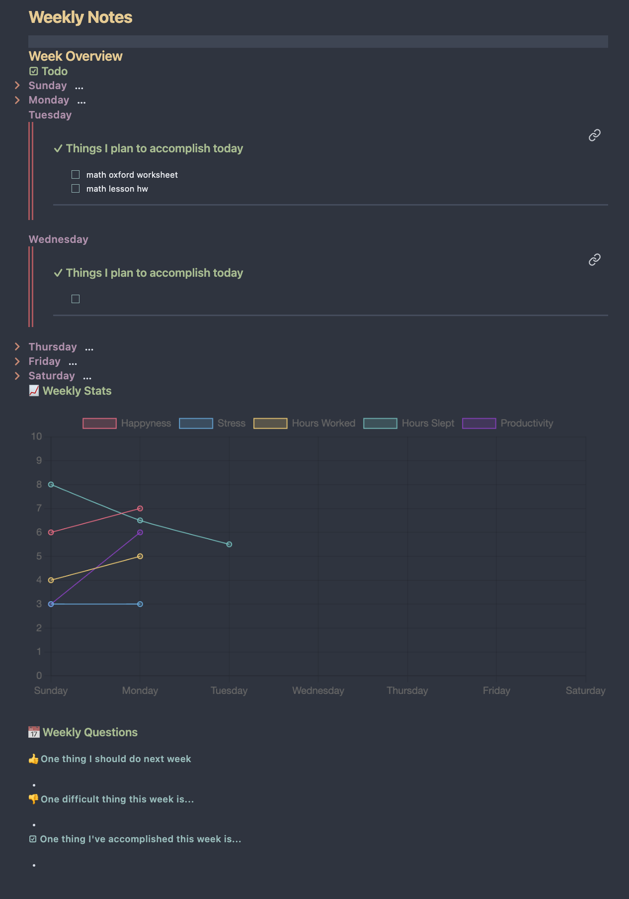
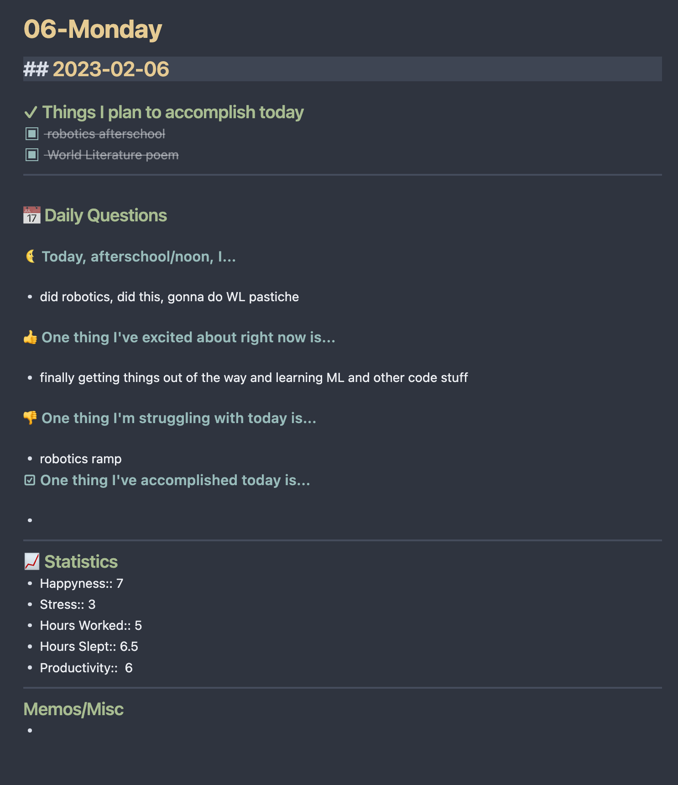

# A Simple Obsidian Daily Template

A basic obsidian daily template, feel free to fork and change things if this is something you're interested in using

## Installation

First install these extensions, without them it would probably not work

- [Templater](https://github.com/SilentVoid13/Templater): It is used for dynamically changing some text elements in files during generation
	- You'll need to go into the settings and turn on the `Trigger templater on new file creation` for this setup to work
- [Obsidian Calendar](https://github.com/liamcain/obsidian-calendar-plugin): It is used for creating daily and weekly note files
	- You could optionally use [Periodic Notes](https://github.com/liamcain/obsidian-periodic-notes) which seems much more customizable and powerful but it seems overkill for my purpose
- [Obsidian Charts](https://github.com/phibr0/obsidian-charts) & [Obsidian Dataview](https://github.com/blacksmithgu/obsidian-dataview): It is used for visualizing and processing your weekly data

Then you'll have to figure out how your notes will be formatted
currently the default is
- Notes
	- YYYY
		- Week W
			- DD-dddd
			- Weekly Notes
If you wish to change it you may need to mess with some of the templater code (which TBH is quite jank because I kept running into issues)

to apply the default settings
- go into daily notes
	- Set new file location to Notes/
	- add `YYYY/[Week] w/DD-dddd` to date format
- go to calendar
	- Turn on `show week number`
	- add `YYYY/[Week] w/[Weekly Notes]` to weekly note format

Then finally you can copy the template files into your vault, copy/download/clone the template files to Notes/ directory then set the corresponding files to the templates in the settings.

## Todo
- [ ] Compare previous weeks data with this weeks data, show improvements, things that decreased, etc.
- [ ] Make some sort of yearly page, a summary of weekly notes
